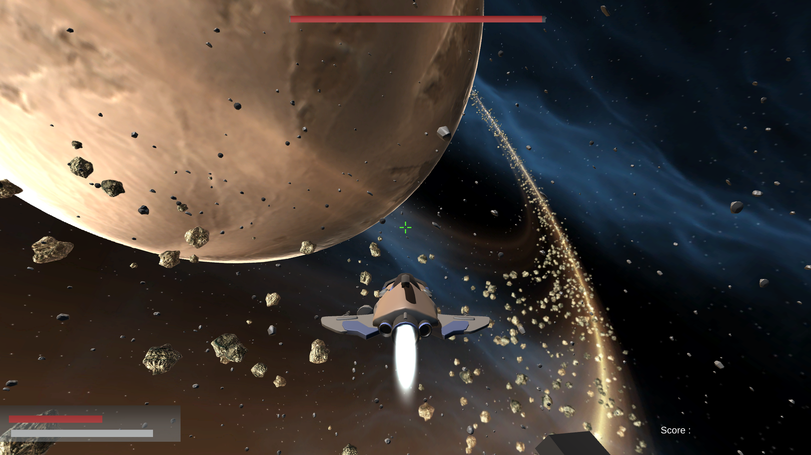
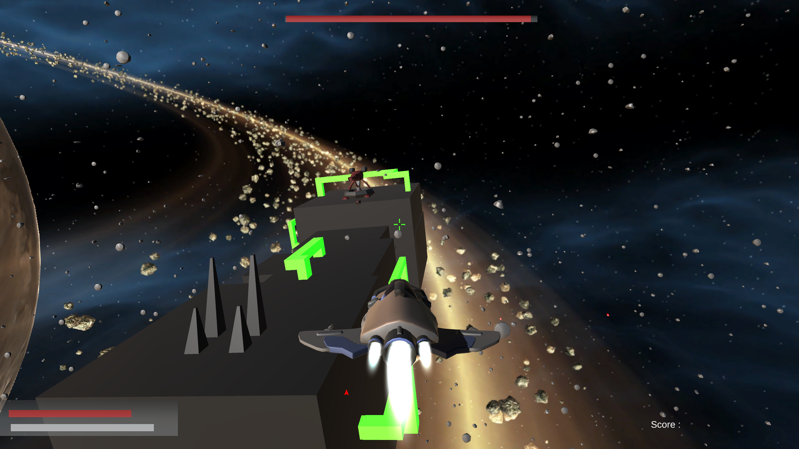
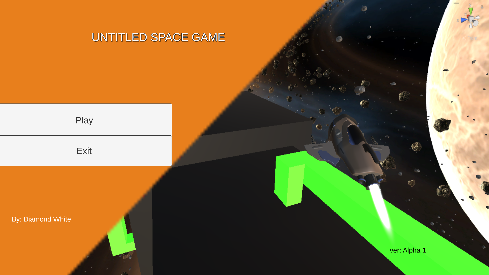
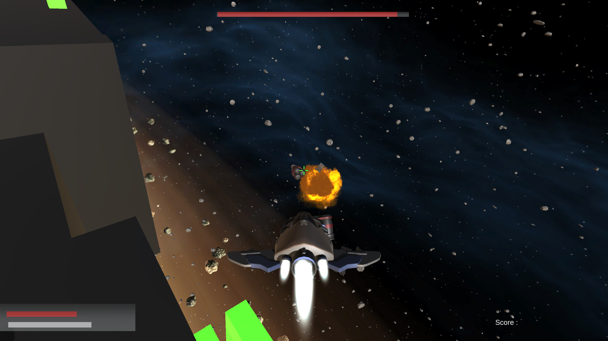

Here’s a well-structured example of how you could design your README for your project **Spaceshooter** using Markdown:

---

# Spaceshooter 🚀

Spaceshooter is a thrilling space-based arcade game where players navigate a spaceship through asteroid fields, engage in combat, and collect power-ups.



---

## 🌌 Features

- **Immersive Gameplay**: Navigate through asteroid fields and avoid obstacles.
- **Combat Mechanics**: Use your spaceship's weapons to destroy enemies.
- **Power-Ups**: Collect health packs, shields, and more by destroying asteroids.
- **Stunning Graphics** 🤯: Beautiful space environments and detailed models.

---

## 🎮 Gameplay
Defend your mothership from enemy fighters by blowing them up. The longer you can keep the mothership alive the higher your score!

### In-Game Preview:


- Dodge asteroids and defeat enemies to increase your score.
- Manage your health and energy carefully to survive longer.
- Collect power-ups for additional advantages.

---

## 🛠️ Installation
**Check out the Releases!**
or,
1. **Clone the Repository**:
   ```bash
   git clone git@github.com:shimmeringDiamond/Spaceshooter.git
   ```
2. **Open the Project in Unity**:
   - Use [Unity Hub](https://unity.com/) to open the project located in the `spaceshooter` directory.
3. **Play the Game**:
   - Press the **Play** button in Unity to start testing the game.

---

## 🖼️ Screenshots

### Main Menu:


### Health Pack Pickup:
